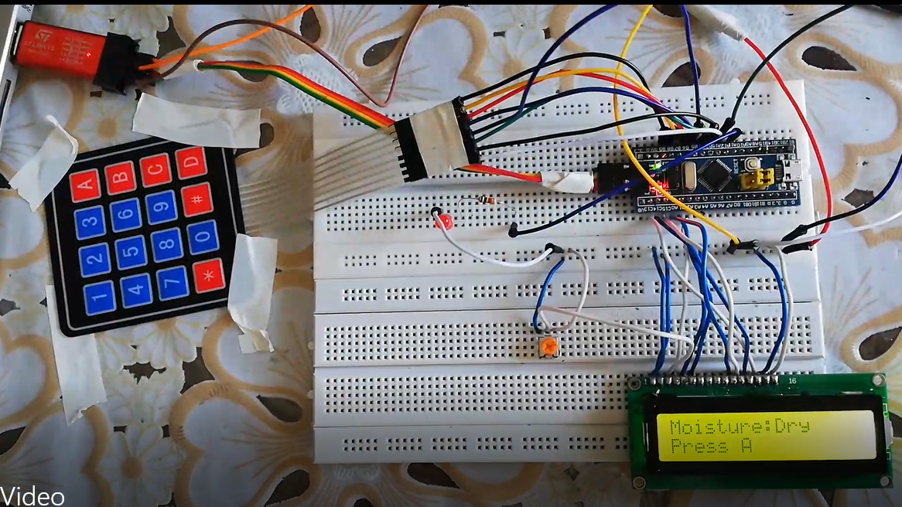
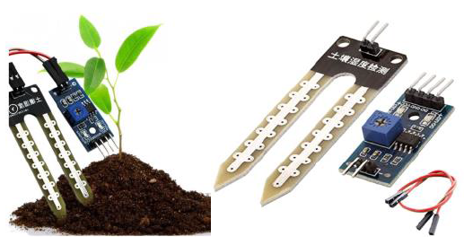
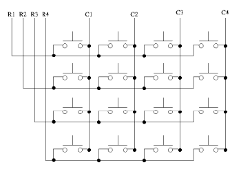
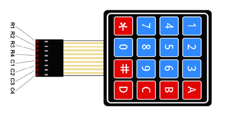
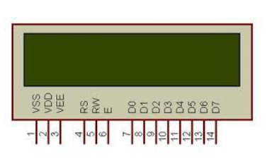
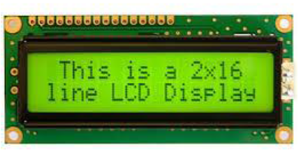

# Making-an-irrigation-system-using-STM32F103CBT6-LCD-Keypad-and-YL_69-soil-moisture-sensor
 
# Project : 
It is an irrigation system that works like this 
We detect tho moisture with YL_69 and if the soil is wet the LCD will show "the soil is wet "  but if it's not, the LCD will show "the soil is dry press A " then if the user presses "A" on the keypad the LCD shows the next menu that asks the user the needed time for irrigation ("1" "2" "3" that is are correspondent to 1 min, 2 min, and 3 min ) so when the user presses one of those buttons the gpio on micro will get one and the irrigation will start and the LCD will show the timer goes down till the soil become wet and this process will repeat.

There is a video of this process you can watch it in the video folder (The video language is Persian)

# YL_69 (Soil moisture sensor) : 
I adjusted the internal potentiometer of this sensor so the output will become one in dry soil and zero in wet soil 

# Keypad: 
We scan every row and every column in a loop if any button is pressed returns the value (the code is based on this logic too ) 

# LCD
I used a 16x2 LCD and the code is based on it's datasheet 

